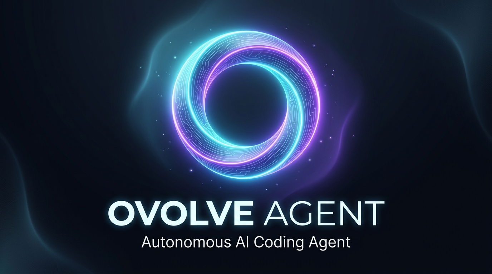

<div align="center">



# Ovolve Agent

**具备物理沙盒、刚性门禁与自进化能力的本地自主编程智能体**

[ 简体中文 ](README.md) · [ English ](README_en.md)

[](LICENSE)
[-brightgreen.svg)](eval_harness/results/gpqa_agent_merged.json)
[-brightgreen.svg)](eval_harness/results/ifeval_agent_20260907_234638.json)
[-orange.svg)](https://api.longcat.chat)
[](#-安全与隐私)

[核心特性](#-四大核心能力) · [快速上手](#-快速启动) · [权威基准](#-权威基准与物理实测) · [系统架构](#-系统核心拓扑) · [模块地图](#-核心模块物理映射)

</div>

---

> ### “它此刻的样子，只是起点。它犯过的错，不会再犯第二次。”
> 
> **Ovolve Agent** 是面向真实生产交付的本地自主编程智能体。在物理沙盒内自愈试错，失败经验沉淀为记忆守则——测试未全绿，绝不入主仓。

---

## 🚀 四大核心能力

### 1. 🛡️ 原生物理沙盒与刚性门禁
* **毫秒级原生沙盒**：基于底层 Git Worktree 机制挂载物理独立工作区，多 Agent 并发互不踩踏；
* **PRE 阶段 AST 语法阻断**：代码落盘前解析抽象语法树，物理拦截 `pass`、`Ellipsis` 与 `TODO` 等偷懒伪代码；
* **SHA-256 验收合同**：任务启动即锁定需求与测试指纹，严禁中途删减测试用例（防弱化门禁）；
* **三路安全合流**：沙盒内真机测试全绿方可自动合流，遇冲突原子回滚并唤起可视化确认。

### 2. 🔄 GEPA 自然语言自进化飞轮
* **失败指纹智能聚类**：运行期捕获编译故障与断言红灯，提取 AST 语法签名自动聚类；
* **四维帕累托寻优**：在准确率、Token 成本、响应延迟、安全边界四维前沿面自动演化系统规则；
* **记忆守则写回**：经验沉淀至 `MEMORY.md` 规则库，无需人工重新调优 Prompt，系统越用越聪明。

### 3. 🧠 六层时空保真记忆网络
* **六层立体记忆架构**：从进程内瞬时暂存（工作记忆）、动态衰减（短期记忆）、25KB 物理硬顶规则库（长期记忆 / `MEMORY.md`），到向量检索（语义记忆）、实体图谱（Wiki）与闲暇反思梦境，层级分明，永不爆窗；
* **30 天半衰期与语义重排**：引入 $w(t) = 2^{-\Delta t / 30}$ 时间衰减算法与 MMR 多样性重排序，自动检测三元组知识冲突，召回高相关、低冗余的最优上下文；
* **前置刷盘与微折叠**：长会话折叠前自动提取用户偏好与关键决策持久化落盘，杜绝经验随压缩蒸发；配合老旧工具输出微折叠与 Head-Tail 日志清洗，大幅削减上下文冗余，根除长任务注意力漂移。

### 4. ⚡ 桌面级 CUA 与浏览器全场景控制
* **Windows 原生自动化**：ctypes 直调 Windows `IUIAutomation` 虚表，毫秒级解析系统控件树，实现操作系统级精准点击与视窗识别；
* **DOM 快照与稳定引用交互**：轻量提取可见交互元素生成紧凑快照，按 Ref 索引定位操作，相比传统全屏截图大幅降低 Token 开销并消除坐标漂移；
* **CDP 录屏与技能自提炼**：真机操作背压录屏结合启发式参数槽位化抽取，经“结构校验 $\rightarrow$ 沙盒试跑 $\rightarrow$ 幂等挂载”三道门自动晋升为可复用技能。

---

## ⚡ 快速启动

### 方式一：Windows 一键极速拉起（推荐）
直接双击运行根目录脚本：
```powershell
.\run-ovolve.bat
```
脚本将自动完成环境依赖检测，并拉起后端引擎（端口 8000）与前端工作台界面（端口 3000）。

### 方式二：开发者手动启动

```bash
# 1. 启动后端引擎 (Python 3.10+)
cd app/backend
pip install -r requirements.txt
python -m uvicorn server.http_server:app --port 8000 --host 127.0.0.1

# 2. 启动前端工作台 (Node.js 18+)
cd app/ui
npm install
npm run dev
```

---

## 📊 权威基准与物理实测

在**严格控制变量**（统一以美团 LongCat-2.0 1.6T MoE 推理底模接入）与 **0-Docker 本地真实子进程退出码 (Exit Code == 0) 断言**的科研纪律下，Ovolve Agent 外骨骼架构实测对比：

| 评测基准 | 考察维度 | LongCat-2.0 官方基线 | **Ovolve Agent 实测** | 架构净增量 | 判定机制 |
| :--- | :--- | :---: | :---: | :---: | :--- |
| **GPQA-Diamond** | 198 题博士级跨学科科学推理 | 88.90% | **91.41%** (181/198) | **+2.51pp** | 统一 Runner 16 并发 + 沙盒多轮自愈闭环 |
| **Google IFEval** | 541 题系统级规则与格式依从 | 90.00% | **93.56%** (654/699) | **+3.56pp** | 真实可执行系统级物理规则校验 |

---

## 🗺️ 系统核心拓扑

```
[ 用户需求 / 任务目标 ]
        │
        ▼
[ 阶段 0：验收合同锁定 ] ──> SHA-256 锁定测试指纹，严禁删题作弊
        │
        ▼
[ 阶段 1：物理沙盒准备 ] ──> 毫秒级挂载 Git Worktree 独立沙盒
        │
        ▼
[ 阶段 2：思考与自愈循环 ]
   ├── 六层记忆装配 (25KB 预算硬顶) + 前置刷盘守则注入
   ├── AST 语法树扫描 ──> 拦截空函数与 TODO 伪代码
   ├── 沙盒真机编译运行与自动化测试
   └── 失败自修 ──> 提取真实 Traceback 驱动模型自愈闭环
        │
        ▼ (沙盒内测试全绿通过)
[ 阶段 3：交付与合流 ]
   ├── 防弱化门禁 ──> 校验断言总数与测试脚本 Hash
   ├── 三路安全合流 ──> 安全合入主工作区，主工程始终零污染
   └── 经验沉淀 ──> 触发 GEPA 飞轮，将修复规则沉淀至 MEMORY.md
```

---

## 📦 核心模块物理映射

| 核心架构模块 | 源码路径 | 核心职责 |
| :--- | :--- | :--- |
| **调度与执行中枢** | `app/backend/router_modules/` | 模块化调度中枢：准入审查、任务分发与 ReAct 循环 |
| **六层记忆时空矩阵** | `app/backend/memory_domain.py` | 统一门面、30 天半衰期衰减、MMR 语义排序与图谱冲突检测 |
| **前置刷盘与微折叠** | `app/backend/context_compactor.py` | 记忆前置持久化、历史工具调用微折叠与 Head-Tail 日志清洗 |
| **物理沙盒与安全合并** | `app/backend/worktree_manager.py` | Git Worktree 毫秒级隔离、生命周期管理与三路安全合流 |
| **验收合同与防弱化** | `app/backend/acceptance_contract.py` | 需求 SHA-256 指纹锁定、测试用例防删改与终态核验门禁 |
| **AST 语法防偷懒** | `app/backend/ast_reviewer_enhanced.py` | 代码生成 PRE 阶段抽象语法树扫描，物理拦截空函数与占位符 |
| **UIA 桌面自动化** | `app/backend/uia_tree.py` | ctypes 直调 Windows `IUIAutomation` 虚表，毫秒级控件树遍历 |
| **DOM 快照与引用交互** | `app/backend/browser_dom_snapshot.py` | 紧凑 DOM 快照渲染与稳定 Ref 编号交互，显著压缩上下文开销并消除坐标漂移 |
| **CDP 录屏与技能提炼** | `app/backend/cdp_screencast.py` | CDP 背压录屏、参数槽位化提炼与技能热挂载 (`WorkflowSkillPromoter`) |
| **纵深安全与 URL 守卫** | `app/backend/url_guard.py` | 五层 SSRF 防御，拉黑云元数据端点与内网探测 |
| **密钥防泄漏闸门** | `app/backend/secret_scan.py` | 前缀树预筛、正则与香农熵校验，拦截高危凭据外泄 |
| **自然语言自进化** | `app/backend/evolution.py` | 错误签名 AST 聚类、四维帕累托候选评估与规则沉淀 |

---

## 🔒 安全与隐私

- **绝对零出域**：完全本地运行，无任何远程遥测上报、无设备指纹收集；
- **沙盒级隔离**：所有代码变更在 Git Worktree 临时副本中运行测试，杜绝意外损坏主分支；
- **纵深安全防御**：内置 URL 守卫、进程级 HMAC 鉴权、密钥泄露扫描与高危命令拦截。

---

## 📄 开源许可证

本项目遵循 [Apache-2.0 License](LICENSE) 开源协议。
